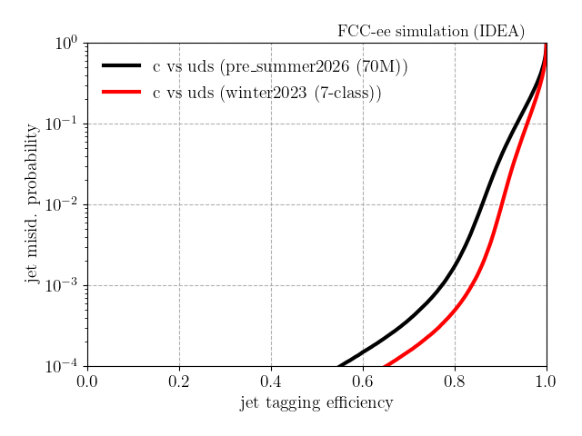
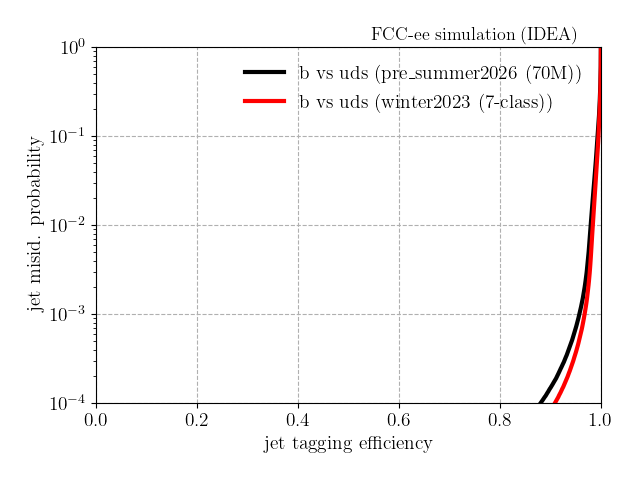
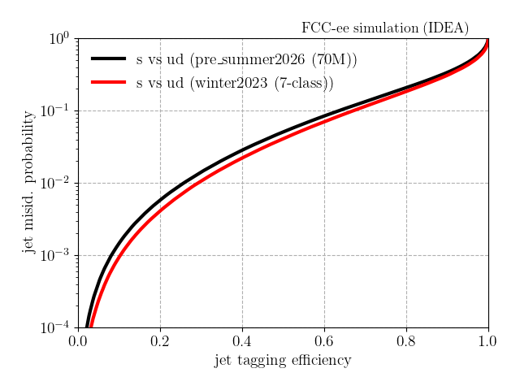
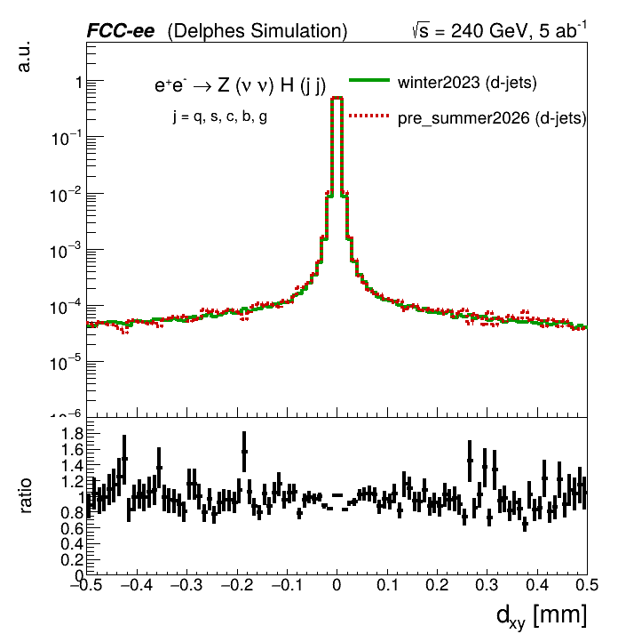
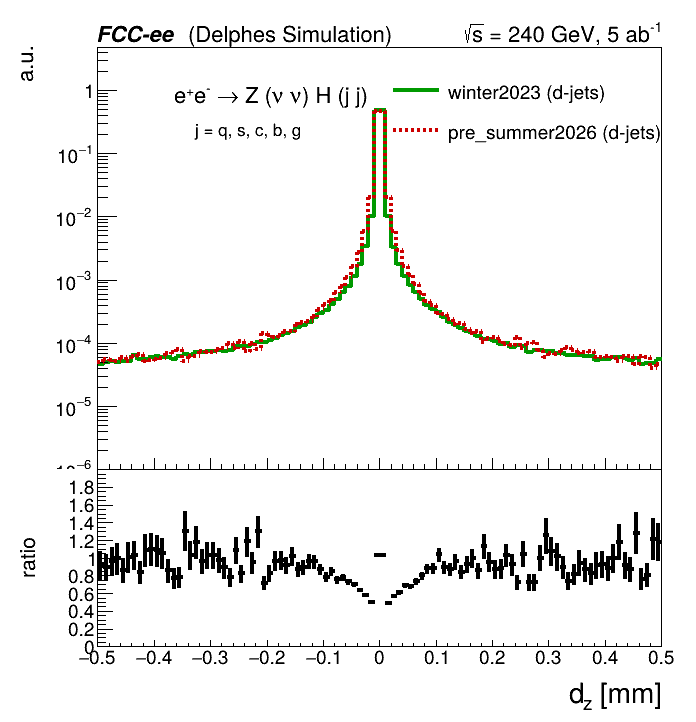

# FCC-ee jet flavour tagging (7-class weaver pipeline)

Tools to build training ntuples, run tagger inference, and make ROC / input-feature
plots for the 7-class jet tagger: **g, u, d, s, c, b, τ**. Jets are reconstructed with
the exclusive ee-kt algorithm (`njets = 2`); all class/feature definitions live in
`config.py`, so the whole pipeline is driven by the `flavors` list and the model JSON.

## Scripts

| script | role | in → out |
|--------|------|----------|
| `config.py` | flavour list, collections, `njets`, feature definitions | — |
| `stage1.py` | cluster jets, compute constituent/jet features + truth (per **event**) | edm4hep → `events` tree |
| `stage2.py` | flatten to per-**jet** ntuple, set one-hot `recojet_is{FLAVOUR}` labels | stage1 → `tree` |
| `stage_all.py` | run stage1+stage2 over all flavours (multiprocessing) | edm4hep dir → ntuples |
| `analysis_inference.py` | cluster + features + tagger inference (writes 7 scores) | edm4hep → `events` tree |
| `plot_rocs.py` | binary-discriminant ROC curves from inference scores | inference trees → `plots/roc_*.png` |
| `stage_plots.py` | input-feature data/MC overlays with ratio panels | stage2 ntuples → PNGs |

The tagger scores are named `recojet_is{G,U,D,S,C,B,TAU}`; `stage2.py` infers a jet's
truth label from the `H{f}{f}` token in the input file name (e.g. `..._Hbb_...` → `recojet_isB`).

## Training-ntuple production

```sh
# stage 1 — per-event features + labels
fccanalysis run examples/FCCee/weaver/stage1.py \
    --output stage1_Hbb.root \
    --files-list <edm4hep>/wzp6_ee_nunuH_Hbb_ecm240/events_*.root --ncpus 8

# stage 2 — flatten to a per-jet ntuple over event range [N_i, N_f)
python examples/FCCee/weaver/stage2.py stage1_Hbb.root stage2_Hbb.root 0 100000

# both stages over every flavour, in one go
python examples/FCCee/weaver/stage_all.py \
    --indir <edm4hep_dir> --outdir <out_dir> --sample wzp6_ee_nunuH --ncpus 64
```

stage1 keeps the two leading jets;
each entry of the stage2 `tree` is one jet, its constituents stored as fixed-length arrays.

## Inference and ROC curves

```sh
# per-flavour inference ntuples (7 scores per jet) — one run per flavour sample
fccanalysis run examples/FCCee/weaver/analysis_inference.py \
    --output <dir>/wzp6_ee_nunuH_Hbb_ecm240/events.root \
    --files-list <edm4hep>/wzp6_ee_nunuH_Hbb_ecm240/events_*.root --ncpus 8

# ROC curves from those score trees (edit the model dirs at the top of the script)
python examples/FCCee/weaver/plot_rocs.py         # full statistics, multi-threaded
ROC_NFILES=1 python examples/FCCee/weaver/plot_rocs.py   # quick test, 1 file/flavour
```

`plot_rocs.py` compares two model variants over a set of signal-vs-background flavour
pairs; the background score is the sum over the listed flavours, so composite backgrounds
(e.g. `uds`, `ud`) use `D(sig,bkg) = score_sig / (score_sig + Σ score_bkg)`.

Example ROC curves (pre_summer2026 70M vs winter2023 7-class):

| c vs uds | b vs uds | s vs ud |
|----------|----------|---------|
|  |  |  |

## Input-feature validation

```sh
python examples/FCCee/weaver/stage_plots.py \
    --indir_a <stage2_dir_A> --label_a winter2023 \
    --indir_b <stage2_dir_B> --label_b pre_summer2026 --outdir <plot_dir>
```

Overlays each pfcand/jet observable for two productions, area-normalised with a ratio
panel — used to check feature agreement across generators or productions. Example: the
leading-constituent transverse and longitudinal impact parameters for light (d) jets.

| light-jet d0 | light-jet z0 |
|--------------|--------------|
|  |  |

