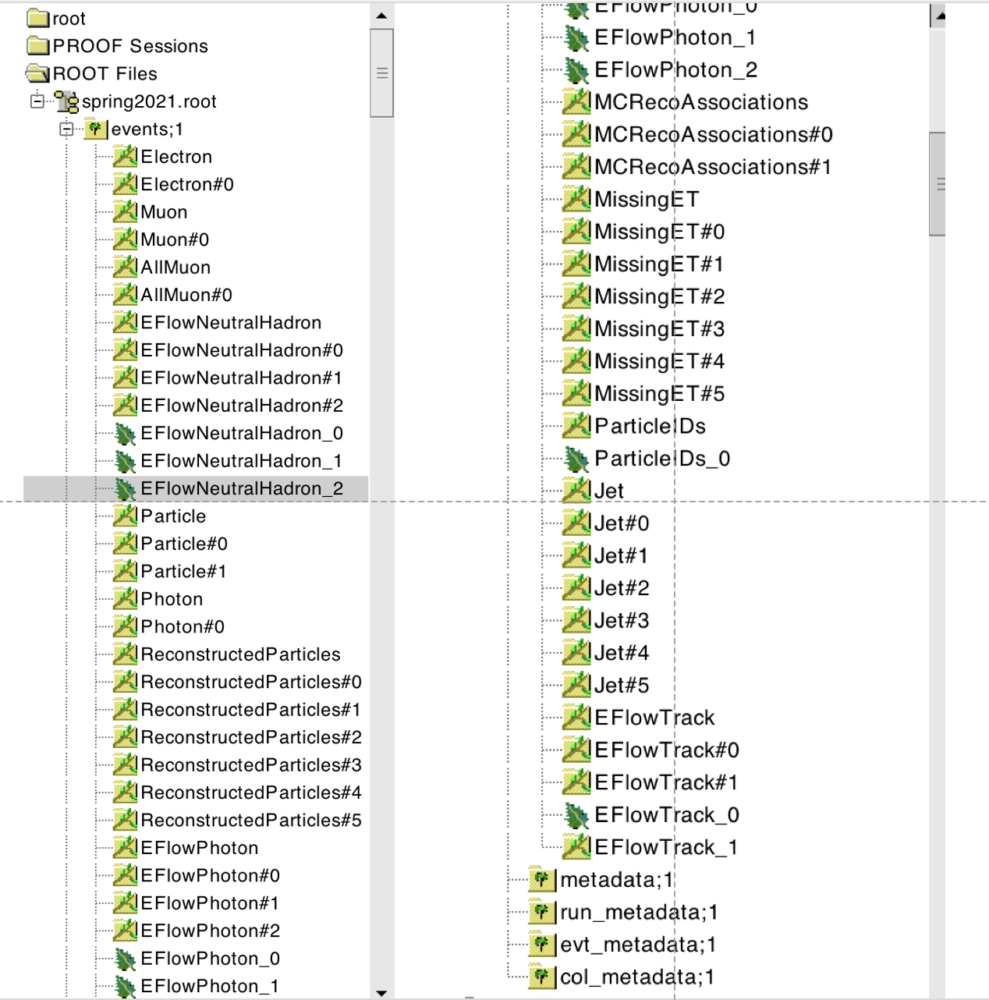
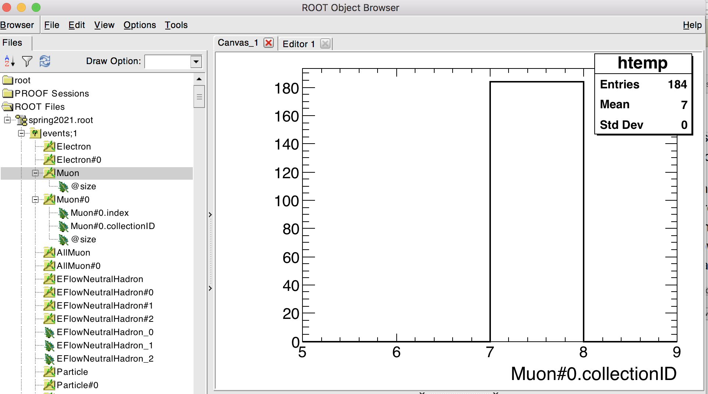

*This page is under development, please be kind in case of inaccuracies* 

Basic examples
=============
This directory contains a number of examples each showcasing a specific functionality of the FCCAnalyses framework. It serves as a reference guide for how to implement specific common usecases or you can work through the examples one-by-one in order as a tutorial to familiarize yourself with the full functionality of the framework. 

Each example is a stand-alone script for demonstration purposes, and does not make assumptions on a specific physics case. To understand how to write a full analysis with the FCCAnalyses framework please have a look at (insert a link to documentation about code class-structure) - the examples here only illustrate specific technical functionalities. 

By calling `python <example>.py` you can run the specific example over the integrated test file found (add the testdata directory), and it will create a new directory in your current working directory with the name of the example to write the output to. If you prefer to run over your own input file or a different output directory you can run with options:

`python <example>.py -i <path_to_your_inputfile> -o <path_to_your_outputdir>`

Certain examples may have additional options, you can always check what options are available with `python <example>.py -h`. 

Table of contents
=================
  * [Prerequisites](#prerequisites)
    * [RDataFrame](#rdataframe)
    * [EDM4HEP event model](#edm4hep-event-model)
    * [Structure of EDM4HEP files](#structure-of-edm4hep-files)
  * [Reading objects from EDM4HEP](#reading-objects-from-edm4hep)
  * [Association between RecoParticles and MonteCarloParticles](#association-between-RecoParticles-and-MonteCarloParticles)
  * [Navigation through the history of the Monte-Carlo particles](#Navigation-through-the-history-of-the-MonteCarloParticles)
  * [Writing your own function](#writing-your-own-function)
    * [Inline](#inline)
    * [Using ROOT GInterpreter](#using-root-ginterpreter)
    * [Writing your own class](#writing-your-own-class)
  * [Base collection](#base-collection)

Prerequisites
=================

The FCCAnalyses framework is based on the [RDataFrame](https://root.cern/doc/master/classROOT_1_1RDataFrame.html) interface which allows fast and efficient analysis of [ROOT's TTrees](https://root.cern/doc/master/classTTree.html) and on samples following the [EDM4HEP event data model](https://edm4hep.web.cern.ch/). Some brief explanations and links to further material on the two are given below, a basic understanding of both is necessary for using this framework to write your own analysis code. 

RDataFrame
=================
(to add)

EDM4HEP event model
=================
[Link to EDM4HEP class overview](https://edm4hep.web.cern.ch/namespaceedm4hep.html)

(to add brief intro/pointers)


Structure of EDM4HEP files
==========================

The content of an EDM4HEP file can be seen by opening it in ROOT, and by inspecting the content of the "events" tree with a TBrowser.
Example with  a file from the "spring2021" campaign :
```
root /eos/experiment/fcc/ee/generation/DelphesEvents/spring2021/IDEA/wzp6_ee_mumuH_ecm240/events_012879310.root 
root[0] TBrowser b
```


As shown in the screenshot above, there are two types of branches:

  - Branches without a pound (#) in their name refer to collections of objects:  Electron (1), Muon (2), AllMuon (3), EFlowNeutralHadron (4), Particle (5), Photon (6), ReconstructedParticles (7), EFlowPhoton (8), MCRecoAssociations (9), MissingET (10), ParticleIDs (11), Jet (12), EFlowTrack (13), EFlowTrack\_1 (14). 
    - NB: "Particle" denotes the collection of Monte-Carlo particles. "Muon" contains the isolated muons, while "AllMuon" contains all muons, isolated or not.
  - Branches with a pound in their name:  Each of the object collections listed above, e.g. "Collection", has up to six associated collections of references, 
    i.e. indices that point to another or to the same object collection. They are labeled Collection#i, with i = 0 ... 5. For example, the Muon collection has one single
    associated collection of references, Muon#0.
    - NB2: With `winter2023` samples, the `CollectionID`s are different. The correct list can be obtained using `podio-dump` or `collInfo` script from [AuxTools](https://github.com/HEP-FCC/AuxTools), e.g.:

```
./collInfo -i /eos/experiment/fcc/ee/generation/DelphesEvents/winter2023/IDEA/p8_ee_ZZ_ecm240/events_051628351.root

ID  ->  Collection
==================
1  -> MissingET
2  -> MCRecoAssociations
3  -> ParticleIDs
4  -> magFieldBz
5  -> TrackerHits
6  -> EFlowTrack
7  -> CalorimeterHits
8  -> Particle
9  -> Photon
10 -> EFlowTrack_L
11 -> Electron
12 -> EFlowPhoton
13 -> EFlowNeutralHadron
14 -> Jet
15 -> ReconstructedParticles
16 -> Muon
==================
```

To figure out which collection is pointed to by Muon#0 (or by any other collection of references), one can look at the value of Muon#0.collectionID (see screenshot below). 
The collectionID of Muon#0 is the collection number 7 (in the example file used here), which, in the list of "object collections" above, corresponds to the collection of ReconstructedParticles. 
Indeed, the Muon collection itself contains nothing (see screenshot below): all the information is contained in the ReconstructedParticles. The Muon collection,
together with Muon#0, just provides a convenient way to access, among the ReconstructedParticles, those that were identified as muons.



The same holds for the Electron and Photon collections. On the other hand, the MissingET collection is already a ReconstructedParticle, as can be seen
by inspecting it in the browser:

     


The "Particle" collection corresponds to the Monte-Carlo particles. It has two associated collections of references, Particle#0 and Particle#1. As can
be seen by looking at their collectionID, they both point to collection number 5, i.e.  to the Particle collection itself. Particle#0 and
Particle#1 contain, respectively, links to the parents and to the daughters of the MC particles - as can be seen in the [edm4hep yaml description here](https://github.com/key4hep/EDM4hep/blob/master/edm4hep.yaml#L118-L119).
Examples will be given below, showing how to navigate through the Monte-Carlo record using Particle, Particle#0 and Particle#1.


Reading objects from EDM4HEP
=============
The example read_EDM4HEP.py shows you how to access the different objects such as jets, electrons, muons, missing ET etc. from the EDM4HEP files. Generally a new variable is calculated with a statement inside the `run()` function of the `analysis` class like
`dataframe.Define("<your_variable>", "<accessor_fct (<name_object>)>")`
which creates a column in the RDataFrame named `<your_variable>` and filled with the return value of the `<accessor_fct>` for the given object. 

Here, accessor functions are the functions found in the C++ analyzers code that return a certain variable. Since the analyzers code defines a specific namespace for each module, such as ReconstructedParticle or MCParticle, the full accessor function call looks like `<namespace>::<function_name>(object)`. To access the pT of a reconstructed object you would therefore call `ReconstructedParticle::get_pt(object)` and for a MC-particle the call would be `MCParticle::get_pt(object)`. The namespace corresponds to the file name of the C++ code, making it clear where to look for the source code if you have a question about the internal workings of one such functions. 

Below you can find an overview of the basic, most commonly required functions, to illustrate the naming conventions. This is not an exhaustive list, if you want to find out all functions that are available please take a look in the respective analyzers code itself - [here for reconstructed particles](https://github.com/HEP-FCC/FCCAnalyses/blob/master/analyzers/dataframe/FCCAnalyses/ReconstructedParticle.h) and [here for MC particles](https://github.com/HEP-FCC/FCCAnalyses/blob/master/analyzers/dataframe/FCCAnalyses/MCParticle.h).


| Variable  | Function name | Available for | 
| ------------- | ------------- | ------------- |
| Transverse momentum  | `get_pt(object)`  | `MCParticle`, `ReconstructedParticle` |
| Pseudorapidity  | `get_eta(object)`  | `MCParticle`, `ReconstructedParticle` |
| Energy  | `get_e(object)`  | `MCParticle`, `ReconstructedParticle` |
| Mass  | `get_mass(object)`  | `MCParticle`, `ReconstructedParticle` |
| Charge  | `get_charge(object)`  | `MCParticle`, `ReconstructedParticle` |
| Number (in event)  | `get_n(object)`  | `MCParticle`, `ReconstructedParticle` |
| PDG ID  | `get_pdg(object)`  | `MCParticle` |


If you want to add your own function have a look at the [Writing your own function](#writing-your-own-function) section on this page. 

For the name of the object, in principle the names of the EDM4HEP collections are used - photons, muons and electrons are an exception where a few extra steps are required, as shown in the example here. 

This example also shows how to apply object selection cuts, for example selecting only reconstructed objects with a transverse momentum pT larger than a given threshold by using the `ReconstructedParticle::sel_pt(<threshold>)(<name_object>)` function. 

In the end of the example you can see how the selected variables are written to branches of the output n-tuple, using the `dataframe.Snapshot("<tree_name>", <branch_list> )`, where in all examples here the name of the output-tree is always `events` and the branch_list is defined as a `ROOT.vector('string')` as demonstrated in the example. Note that branches of variables that exist multiple times per event, i.e. anything derived from a collection such as the pT of jets, result in vector branches. This is also true for some quantities that in principle only exist once per event, but are collections in the EDM4HEP format, such as the missing transverse energy. 


Association between RecoParticles and MonteCarloParticles
==========================================================

By design, the association between the reconstructed particles and the Monte-Carlo particles proceeds via the MCRecoAssociations collection, and its two
associated  collections of references, MCRecoAssociations#0 and MCRecoAssociations#1, all of the same size. The collectionID of MCRecoAssociations#0 is equal to 7 in the example file used here (see above, "Structure of EDM4Hep files"), which means
that MCRecoAssociations#0 points to the ReconstructedParticles. While the collectionID of MCRecoAssociations#1 is equal to 5, i.e. 
MCRecoAssociations#1 points to the Particle collection (i.e. the Monte-Carlo particles).    

Their usage is best understood by looking into the code of [ReconstructedParticle2MC::getRP2MC_index](https://github.com/HEP-FCC/FCCAnalyses/blob/96c132c452469d4f66c8752c0397ba542d61cf75/analyzers/dataframe/src/ReconstructedParticle2MC.cc#L126-L136) reported below:
```
ROOT::VecOps::RVec<int>
ReconstructedParticle2MC::getRP2MC_index(ROOT::VecOps::RVec<int> recind, 
					 ROOT::VecOps::RVec<int> mcind, 
					 ROOT::VecOps::RVec<edm4hep::ReconstructedParticleData> reco) {
  ROOT::VecOps::RVec<int> result;
  result.resize(reco.size(),-1.);
  for (size_t i=0; i<recind.size();i++) {
    result[recind.at(i)]=mcind.at(i);	# recind.at(i) is the index of a reco'ed particle in the ReconstructedParticles collection
					# mcind.at(i) is the index of its associated MC particle, in the Particle collection
  }
  return result;
}
```

which, in a FCCAnalyses configuration file, will be called via :
```
               .Alias("MCRecoAssociations0", "MCRecoAssociations#0.index")
               .Alias("MCRecoAssociations1", "MCRecoAssociations#1.index")
               .Define('RP_MC_index',            "ReconstructedParticle2MC::getRP2MC_index(MCRecoAssociations0,MCRecoAssociations1,ReconstructedParticles)") 
```
( the first two lines are needed for RootDataFrame to understand the pound (#) sign).

The method getRP2MC_index creates a vector that maps the reconstructed particles and the MC particles:
RP\_MC\_index[ ireco ] = imc ,  where ireco is the index of a reco'ed particle in the ReconstructedParticle collection, and imc is the index, in the Particle collection, of its associated MC particle.   

**Careful:** as can be seen from the code, the method getRP2MC_index must be passed **the full collection**, ReconstructedParticles, and **not** a subset of reco'ed particles. 
To retrieve the associated MC particle of one reco'ed particle, or of a subset of reco'ed particles, one should have kept track of the indices of these
particles in the ReconstructedParticles collection. It can be a good practise to design analyses that primarily use indices of RecoParticles, instead of
the RecoParticles themselves.
However, for a charged reco'ed particle RecoPart, one can also use the following workaround:
```
     int track_index = RecoPart.tracks_begin ;   // index in the Track array
     int mc_index = ReconstructedParticle2MC::getTrack2MC_index( track_index, recind, mcind, reco );
```
where "recind" refers to "MCRecoAssociations0", "mcind" to "MCRecoAssociations1", and "reco" to "ReconstructedParticles".


Navigation through the history of the MonteCarloParticles
============================================================

To retrieve the **daughters** of a Monte-Carlo particle (in the "Particle" collection), one should use the
collection of references to daughters ("Particle#1", which points to "Particles"), together with the "Particle" collection itself.    

Each particle in the "Particle" collection contains two integers, daughters\_begin and daughter\_end.
The indices, in the "Particle" collection, of the daughters of the particle are stored in "Particle#1", between
daughters\_begin and daughter\_end. This is illustrated in the code of [MCParticle::get\_list\_of\_daughters\_from\_decay](https://github.com/HEP-FCC/FCCAnalyses/blob/master/analyzers/dataframe/src/MCParticle.cc#L481) reported below:
```
std::vector<int> MCParticle::get_list_of_particles_from_decay(int i, ROOT::VecOps::RVec<edm4hep::MCParticleData> in, ROOT::VecOps::RVec<int> ind) {

  std::vector<int> res;

  // i = index of a MC particle in the Particle block
  // in = the Particle collection
  // ind = the block with the indices for the daughters, Particle#1.index

  // returns a vector with the indices (in the Particle block) of the daughters of the particle i

  int db = in.at(i).daughters_begin ;
  int de = in.at(i).daughters_end;
  if  ( db == de ) return res;   // particle is stable
  for (int id = db; id < de; id++) {
     res.push_back( ind[id] ) ;
  }
  return res;
}
```

This returns the "first branching" daughters. For example, if we have a Higgs that decays into ZZ\*, with both Z's decaying into muons, the method get\_list\_of\_daughters\_from\_decay, applied to i = the index of the Higgs, returns the indices of the two Z's in the Particle collection.
In order to retrieve the indices of the four muons, use instead [MCParticle::get\_list\_of\_stable\_daughters\_from\_decay](https://github.com/HEP-FCC/FCCAnalyses/blob/9937fe77e5702b30d53b5e364b3fa6a4b134197c/analyzers/dataframe/src/MCParticle.cc#L447)

These functions are not meant to be called directly from the python configuration file, but from some other function that will determine the value of the argument "i". See an example [here](https://github.com/HEP-FCC/FCCeePhysicsPerformance/blob/069b633ab06126546daa0b0ba4719342096a9a4a/case-studies/flavour/VertexExamples/analysis_Bs2DsK.py#L63) in FCCeePhysicsPerformance, the important lines being:
```
               .Alias("Particle1", "Particle#1.index")
               # MC indices of the decay Bs -> Ds+ K-
               # In the file I process, only the Bs0 (not the Bsbar) has been forced to decay into Ds+ K-
               # Look for (Ds+ K-) in the list of unstable decays of a Bs - hence oscillations are
               # not accounted for. So there should be at most one such decay per event. In any case,
               # would there be > 1, the method gives the first one encountered.
               # Returns the indices of : mother Bs, Ds+, K-

               .Define("Bs2DsK_indices", "MCParticle::get_indices_ExclusiveDecay( -531, {431, -321}, false, false) ( Particle, Particle1)" )
```

Again, the first line is needed for RootDataFrame to interpret correctly the pound sign.   

To retrieve the **parents** of a Monte-Carlo particle: the logics is the same, one should use parents\_begin and parents\_end, which point to the "Particle#0" collection.


<!--
======================================================

GUIDELINES and REQUEST  for new instructions to be added 


FACT: The general newcomer planning to do a  "case study" needs first to have instruction about how to unpack the variable he/she needs from the EDM4HEP into the flat ntuple. 
Very likely he/she has no idea about what the analysis will look like yet.  

More details about how this can be organizes: 

-- introduce links to  the manual for the "data frame" framework from root. 
Since there is a large amount of information and it is easy to get lost please add pointers to specific pages/examples. 

-- have simple examples on how to extract the variables from the edm4hep and add them to the branch in the analysis.py routine: 
    * in the case of a simple basic objects (i.e. jets, electrons, muons...) 
    * in the case of derived objects that need to be calculated: like jet pt
    * where do we find the functions needed already available for a specific object 

-- where in the code do we add NEW functions to obtain new variables/corrections  to be used in analysis.py to create our variables 
    * for instance a recent one: vertexing and new vertices information 
    * invariant masses 
    * etc ...
-- some of this exist but it is buried in the different places, I would suggest to streamlined it in a "fake" example that contains a bit of everything in the same place. 

-- explain more clearly the interplay of the "analysis.py" code and the "FinalSel.py" code in terms of the possibility of having 
calculations done in one or the other. With a couple of concrete examples. 

-- explain which files need to be modified, in case someone wants to use a personal "source file" not in the official repository.  
      * For example, you may need some code that is not generic at all, but very just used by your analysis. 
      So, instead of polluting the existing files MCParticle.cc etc, you may want to
      put this code into some MyStuff.cc.
      * explain how to compile it to use it into the analysis (add it into  the CmakeLists.txt for instance. Not obvious for everyone)

-->
